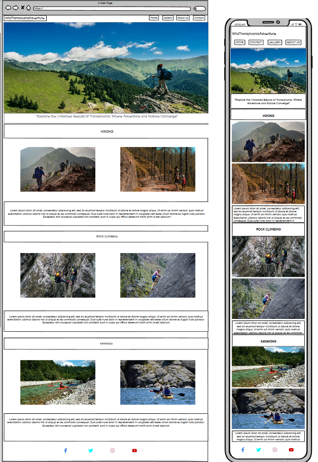
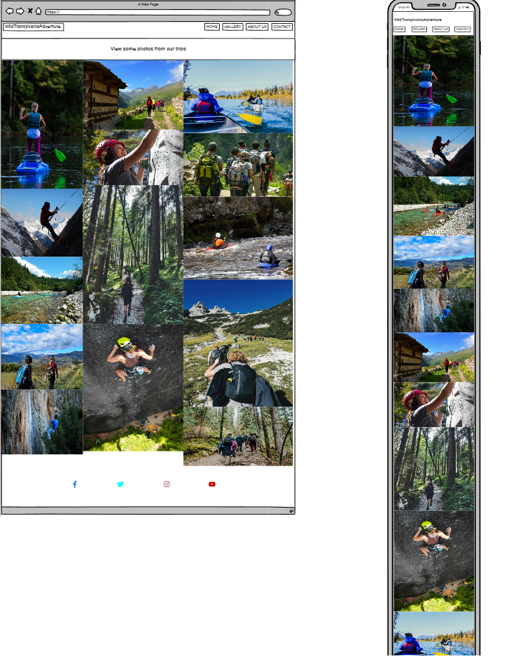
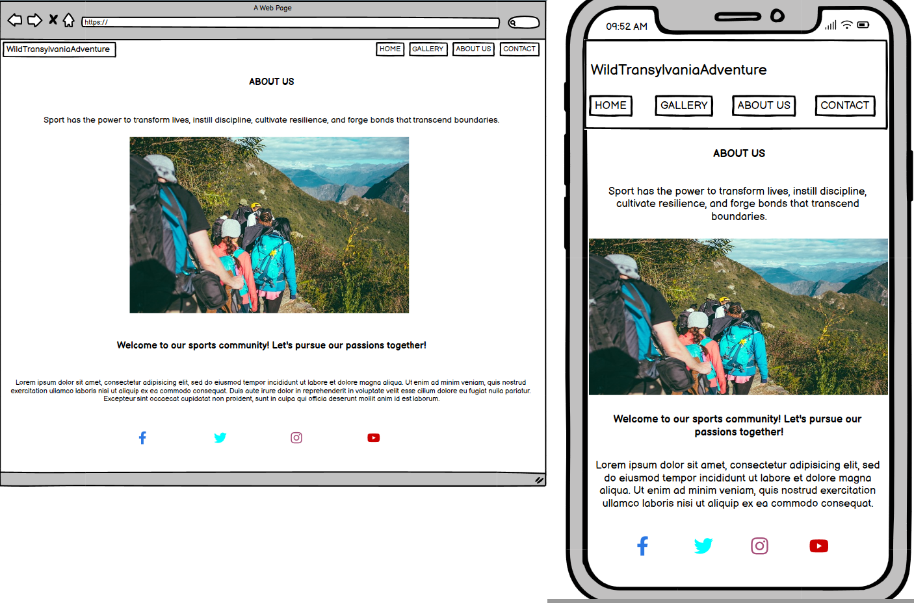
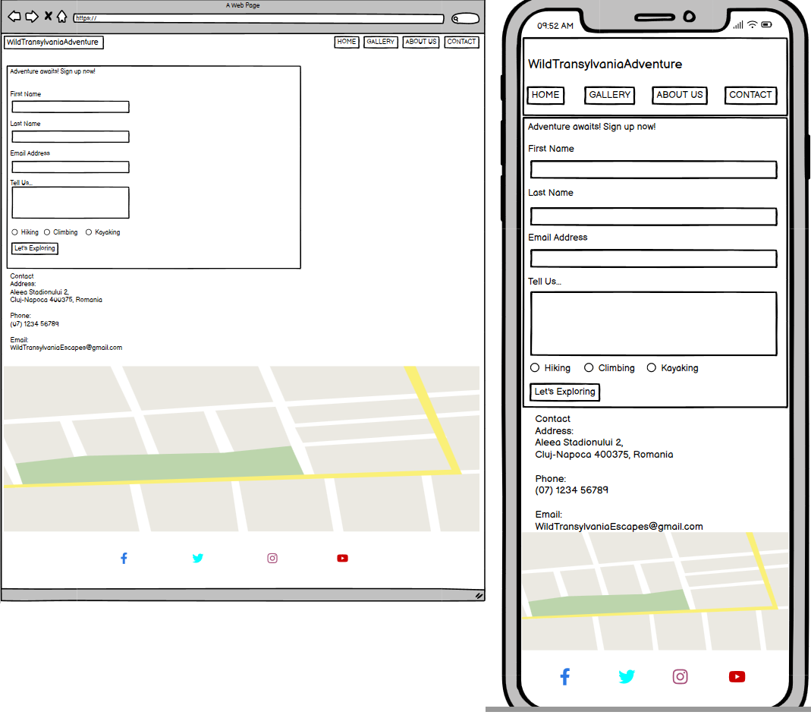

# Wild Transylvania Escapes

 

# A responsive website that organise activities and allows people to join along other groups specific acvtivities

## Code Institute - Milestone Project 1

### By Robert-Cristian Matyas

[View Repository in GitHub Pages] (https://github.com/RobMaty/project-1-wild-transylvania-escapes)

[view Website Link] (https://robmaty.github.io/project-1-wild-transylvania-escapes/)
## The Why

Wild Transylvaniaa Escapes was created to make the natural beauty of Transylvania accessible to adventure enthusiasts. Our goal is to provide information on our various outdoor activities, including hiking, rock climbing, and kayaking, and to share our passion for the region's unique landscape and experiences.

## The Business Goal

+ Increase the number of new participants in our activities
+ Boost sales of introductory offers and packages

## (UX) User Experience

Users will be able to find relevant information in the website related to specific activities, and to book an activity or more depending on what they prefer.

### First-time User Goals:
- Be captivated by the content
- Learn about introductory offers
- Understand the different activities offered
- Know the location and how to reach us

### Returning User Goals:
- Easily find and navigate to relevant information
- Contact us effortlessly
- Access important links quickly

### Frequent User Goals:
- Discover new offers and updates
- Check the latest activity schedules
- See updates on guides and tours

## Design

The website is designed to invite visitors to explore and participate in our adventures. It features a clean, easy-to-navigate layout with inspiring images showcasing the beauty of Transylvania and the excitement of our activities.

### Design Brief:

+ Color:

The colors were selected to give the nature a vibrant vibe, and the main colors used are:

- Green: Symbolizes nature, growth, and adventure, reflecting the essence of outdoor activities.

- Brown: Represents stability and reliability, emphasizing our commitment to safety and professionalism. 

- White: Suggests purity and somplicity, creating a clean and inviting design.

+ Typography:

- Roboto = Simple style for clean and readable information

- Amatic SC = For Headings. Gives a fun and wild impresion, and changes the perspective to one related to nature.

+ Images: 

- Hero Image: Showcases a stunning Transylvanian landscape to captivate and invite visitors.

- Activity Images: Display participants engages in hiking, rock climbing, and kayaking to inspire and motivate potential adventurers.

## Wireframes:

The Basic structure of Rock Bristol Yoga School was skectched using [balsamiq](https://balsamiq.com/).

Here some images of the proccess

- Main Page :    

- Gallery Page :   
 

- AboutUs Page :    

- Contact Page :   

## Features

- #### Existing Features:

 + Navigation Bar: Links to "Home", "Gallery", "About Us", and "Contact" pages for easy navigation.

 + Activity Details: Comprehensive information about hiking, rock climbing, and kayaking experiences.

 + Gallery: Visual highlights of past adventures to inspire and motivate visitors.

 + Contact Form: Included in the "Contact" page, allowing users to easily register their interest or enquiries.
 
 + Google Maps Integration: An iframe showing the location of our starting points and meeting spots for activities.

 #### Future Features:

 + Online Banking and Payment : The posibility to pay for future trips in advance and allocate your spot.

### Languages used: 

- [HTML](https://en.wikipedia.org/wiki/HTML5)

- [CSS](https://en.wikipedia.org/wiki/CSS)

### I Also used:

 - [Google Fonts](https://fonts.google.com/)

 - [Balsamiq](https://balsamiq.com/)

 - [Font awesome](https://fontawesome.com/)

 - [Pexels](https://www.pexels.com/)

 - [Pixabay](https://pixabay.com/)

